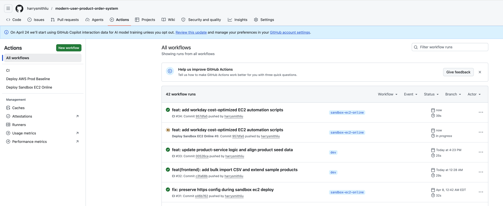
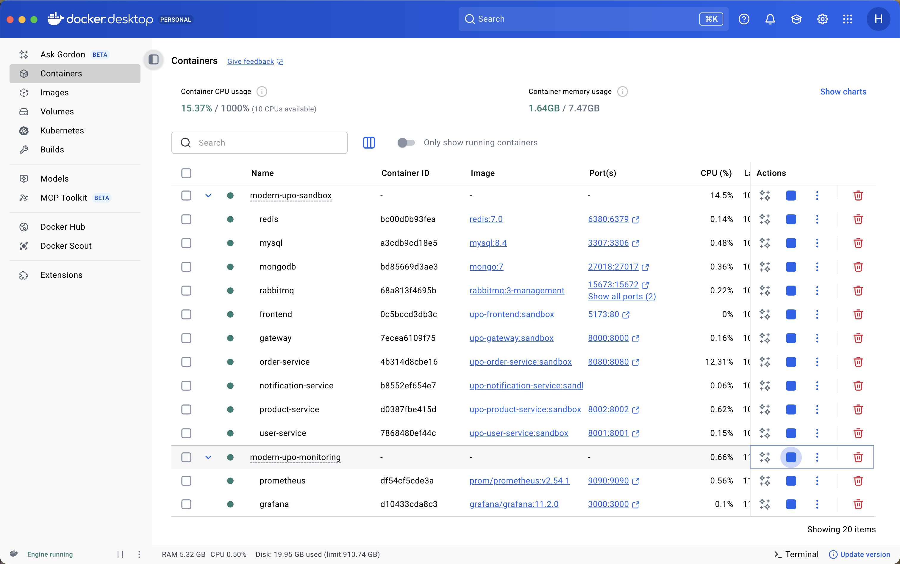
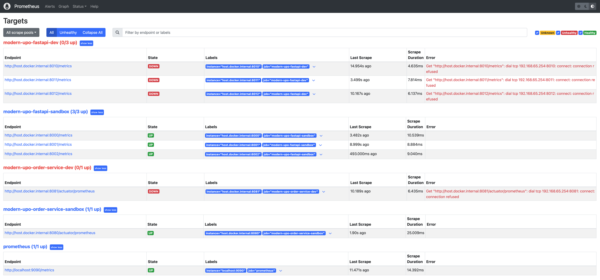
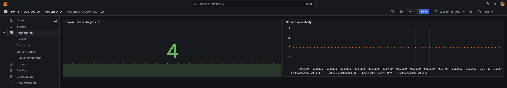

# Modern User-Product-Order System

<h2><a href="https://harrysmithliu.com"><font color="#000000"><strong>Main site: https://harrysmithliu.com</strong></font></a></h2>

A portfolio-focused polyglot microservices commerce demo built around three core domains:

- users
- products
- orders

The project is intentionally designed as a **minimal but complete modern architecture demo**. It emphasizes clear service boundaries, runnable local development, API-driven frontend integration, and room for production-oriented upgrades such as Redis, RabbitMQ, Kubernetes, and cloud deployment.

## Highlights

- Polyglot backend:
  - `user-service` in Python / FastAPI
  - `product-service` in Python / FastAPI
  - `order-service` in Java / Spring Boot
- Dedicated API gateway with JWT verification and route forwarding
- React + Vite + TypeScript frontend
- MySQL split by domain schema
- Idempotency-ready order design with `request_no`
- Admin and user flows in a single demo UI
- Local-first development with infrastructure already available for Redis and RabbitMQ

## Current Status

The repository is under phased implementation.

- Phase 1:
  - login
  - profile update
  - password change
  - product listing
  - create order
  - cancel order
  - admin order review
  - admin product management
- Phase 2:
  - Redis-backed product cache
  - Redis-backed logout blacklist
  - Redis-backed gateway rate limiting
  - RabbitMQ-backed order event flow
  - outbox-backed event staging in `order-service`
  - MongoDB-backed order event timeline sink
  - Docker Compose
  - unified production polish
- Phase 3:
  - Kubernetes
  - monitoring
  - load testing
  - AWS migration notes
  - CI/CD baseline

Phase 3 has now started with:

- a Kubernetes sandbox manifest baseline under `infra/k8s/sandbox`
- runtime-configurable frontend API routing for ingress-based deployments
- Prometheus / Grafana bootstrap assets under `infra/monitoring`
- starter `k6` load-test scripts under `scripts/load`
- a first GitHub Actions CI workflow under `.github/workflows/ci.yml`
- expanded AWS production migration notes under `infra/aws/prod`

## Screenshots

### Sign-In


### Admin Order Review


### Product Listing


### Product Admin


## Architecture Overview

Detailed cross-service message flow diagrams live in [docs/architecture.md](docs/architecture.md), including the RabbitMQ main chain, reliability side chain, and routing fan-out view.

Phase 3 deployment and performance notes now also include:

- [docs/pressure-test.md](docs/pressure-test.md)
- [docs/sandbox-operations-runbook.md](docs/sandbox-operations-runbook.md)
- [infra/monitoring/README.md](infra/monitoring/README.md)
- [infra/k8s/sandbox/README.md](infra/k8s/sandbox/README.md)
- [infra/aws/prod/README.md](infra/aws/prod/README.md)
- [infra/aws/prod/checklist.md](infra/aws/prod/checklist.md)

### Services

- `frontend`
  - React application for user and admin flows
- `gateway`
  - FastAPI gateway for routing, JWT verification, and request user context propagation
- `services/user-service`
  - authentication and user profile management
- `services/product-service`
  - product listing, product administration, stock mutation APIs
- `services/order-service`
  - order creation, cancellation, and admin approval / rejection
- `services/notification-service`
  - RabbitMQ consumer for order lifecycle notifications and MongoDB-backed audit sink

### Data and Infra

- MySQL
  - `h_user_db`
  - `h_product_db`
  - `h_order_db`
- Redis
  - active for product catalog caching in `product-service`
  - active for JWT blacklist support in `user-service`
  - active for gateway login and order-create rate limiting
- RabbitMQ
  - active for outbox-relayed order lifecycle event fan-out from `order-service`
  - active for the lightweight `notification-service` consumer
- MongoDB
  - active for the optional `order_event_timeline` audit sink in `notification-service`
  - reserved for side-channel audit logs and notification records
  - intentionally kept out of the critical relational transaction path

## Tech Stack

### Frontend

- React 18
- Vite
- TypeScript
- Ant Design
- Axios
- React Router

### Backend

- FastAPI
- SQLAlchemy
- Spring Boot
- Spring Data JPA
- Spring Security
- springdoc-openapi

### Infrastructure

- MySQL 8
- Redis 7
- RabbitMQ 3
- lightweight notification worker
- Docker / Docker Compose
- Kubernetes sandbox baseline now available under `infra/k8s/sandbox`

## Repository Structure

```text
modern-user-product-order-system/
├── frontend/
├── gateway/
├── services/
│   ├── user-service/
│   ├── product-service/
│   ├── order-service/
│   └── notification-service/
├── docs/
├── infra/
│   ├── docker/
│   ├── k8s/
│   └── aws/
├── scripts/
└── .github/workflows/
```

## Environment Strategy

The repository now follows a primary AWS / EKS deployment line, with a secondary EC2 online demo line for cost-efficient public hosting.

- `dev`
  - day-to-day developer iteration
  - may use direct local process startup or `infra/docker/docker-compose.dev.yml`
  - expects host-managed infrastructure when using the lightweight Compose stack
- `sandbox`
  - full integration and demo environment
  - uses `infra/docker/docker-compose.sandbox.yml`
  - includes MySQL, Redis, RabbitMQ, and MongoDB containers
- `prod`
  - AWS / EKS baseline for the main deployment line
  - configuration placeholders live under `infra/k8s/prod/` and `infra/aws/prod/`
- `sandbox-ec2-online`
  - auxiliary low-cost public demo environment
  - uses a single EC2 host with Docker Compose, Nginx, Let's Encrypt, and GitHub Actions
  - deployment assets live under `infra/aws/sandbox-ec2`

## Branching and Promotion Strategy

This repository is intended to follow three long-lived branches that mirror the main delivery line:

- `dev`
  - the active development trunk
  - feature work should branch from `dev`
  - new work is merged back into `dev` first
- `sandbox`
  - the integration, demo, and pre-release validation branch
  - changes are promoted from `dev` into `sandbox` after a coherent feature batch is ready for end-to-end verification
- `main`
  - the most stable showcase branch
  - intended to represent the latest approved release candidate for portfolio presentation and AWS / EKS promotion

Auxiliary public demo branch:

- `sandbox-ec2-online`
  - the long-running low-cost public demo branch
  - intended to stay close to sandbox-approved changes while using the EC2 runtime path

Recommended branch flow:

```text
feature/* -> dev -> sandbox -> main
```

Supplementary demo flow:

```text
sandbox -> sandbox-ec2-online
```

Recommended collaboration rules:

- create feature branches from `dev`
- open pull requests back into `dev` for day-to-day implementation work
- promote `dev` into `sandbox` when the integration set is ready for smoke tests, screenshots, and demo review
- promote `sandbox` into `main` only after validation passes
- treat `main` as the branch that should stay the cleanest and most presentation-ready
- selectively cherry-pick sandbox-approved changes into `sandbox-ec2-online` for the public EC2 demo line

Current practical meaning:

- merging into `dev` means the work is ready for developer iteration
- merging into `sandbox` means the work is ready for full Compose-based integration and demo validation
- merging into `main` means the work is stable enough to be presented as the current best version of the project and promoted through the AWS / EKS path
- merging into `sandbox-ec2-online` means the work is ready for the low-cost EC2 demo deployment path

Future CI/CD mapping:

- `dev`
  - run build, lint, unit tests, and service-level checks
- `sandbox`
  - run integration build, smoke test, and sandbox deployment
- `main`
  - run release build and the AWS / EKS deployment workflow
- `sandbox-ec2-online`
  - run the EC2 demo deployment workflow

Shared CI and split CD:

- shared CI
  - `dev`, `sandbox`, `main`, `dev-*`, and `sandbox-ec2-online` use the common [ci.yml](.github/workflows/ci.yml) workflow for frontend build, Python test execution, and Java package validation
- AWS / EKS deployment route
  - `main` uses [deploy-aws-prod.yml](.github/workflows/deploy-aws-prod.yml) as the production deployment baseline for ECR and EKS rollout automation
- EC2 demo deployment route
  - `sandbox-ec2-online` uses [deploy-sandbox-ec2.yml](.github/workflows/deploy-sandbox-ec2.yml) for low-cost always-on EC2 deployment over SSH

### CI/CD Snapshot



This snapshot shows the current pipeline split in practice:

- shared CI validates `dev`, `sandbox`, `main`, `dev-*`, and `sandbox-ec2-online`
- `main` keeps the AWS / EKS production deployment baseline through `deploy-aws-prod.yml`
- `sandbox-ec2-online` runs the EC2 demo deployment through `deploy-sandbox-ec2.yml`

## Local Run

### Sandbox Compose Run

From the repository root:

```bash
docker compose --env-file infra/docker/.env.sandbox.example -f infra/docker/docker-compose.sandbox.yml up --build
```

This stack starts:

- frontend
- gateway
- user-service
- product-service
- order-service
- notification-service
- mysql
- redis
- rabbitmq
- mongodb

The MySQL container initializes the three schemas, core tables, demo users, and sample products on first boot.

### Dev Compose Run

From the repository root:

```bash
docker compose --env-file infra/docker/.env.dev.example -f infra/docker/docker-compose.dev.yml up --build
```

This lightweight stack expects host-managed infrastructure, such as your existing local MySQL, RabbitMQ, MongoDB, and Redis (`local-redis`) containers.

### Monitoring Compose Run

From the repository root:

```bash
docker compose --env-file infra/docker/.env.monitoring.example -f infra/docker/docker-compose.monitoring.yml up -d
```

Default local URLs:

- Prometheus: `http://localhost:9090`
- Grafana: `http://localhost:3000`

### Kubernetes Sandbox Validation

From the repository root:

```bash
bash scripts/dev/validate-k8s-sandbox-kind.sh
```

This script creates or reuses the local `kind-modern-upo` cluster, loads the
current `upo-*:sandbox` images, applies `infra/k8s/sandbox`, and waits for the
core sandbox Deployments to become ready.

### 1. Start the backend services

Gateway:

```bash
cd gateway
python3 -m venv .venv
source .venv/bin/activate
pip install -r requirements.txt
uvicorn app.main:app --reload --port 8000
```

User service:

```bash
cd services/user-service
python3 -m venv .venv
source .venv/bin/activate
pip install -r requirements.txt
uvicorn app.main:app --reload --port 8001
```

Product service:

```bash
cd services/product-service
python3 -m venv .venv
source .venv/bin/activate
pip install -r requirements.txt
uvicorn app.main:app --reload --port 8002
```

Order service:

```bash
cd services/order-service
mvn spring-boot:run
```

Notification service:

```bash
cd services/notification-service
python3 -m venv .venv
source .venv/bin/activate
pip install -r requirements.txt
python -m app.main
```

### 2. Start the frontend

```bash
cd frontend
npm install
npm run dev
```

Frontend URL:

- `http://localhost:5173`

### 3. Sandbox smoke tests and promotion

The sandbox-only smoke tests and EC2 promotion flow now live in
[scripts/sandbox/README.md](scripts/sandbox/README.md).

Use that guide for:

- Phase 1 sandbox smoke test
- Phase 2 sandbox smoke test
- optional RabbitMQ smoke test
- optional MongoDB audit smoke test
- selective sync into `sandbox-ec2-online`

Reference screenshots:







Grafana credentials:

- username: `<set-in-local-env>`
- password: `<set-in-local-env>`

## Local Access Points

Sandbox:

- Frontend: `http://localhost:5173`
- User service docs: `http://localhost:8001/docs`
- Product service docs: `http://localhost:8002/docs`
- Order service docs: `http://localhost:8080/swagger-ui/index.html`
- Sandbox MySQL: `localhost:3307`
- Sandbox Redis: `localhost:6380`
- Sandbox RabbitMQ AMQP: `localhost:5673`
- Sandbox RabbitMQ management: `http://localhost:15673`
- Sandbox MongoDB: `mongodb://<mongo_user>:<mongo_password>@localhost:27018`

Dev compose:

- Frontend: `http://localhost:5174`
- User service docs: `http://localhost:8011/docs`
- Product service docs: `http://localhost:8012/docs`
- Order service docs: `http://localhost:8081/swagger-ui/index.html`

## New Branch Development Runbook

Use this flow when following the long-lived `dev -> sandbox -> main` promotion model and starting a new batch of implementation work.

### 1. Refresh local `main`

```bash
git checkout main
git pull origin main
```

### 2. Sync `dev` with the latest `main`

```bash
git checkout dev
git merge main
git push origin dev
```

### 3. Create a new feature branch from `dev`

Replace `dev-xxx` with the actual workstream name, for example `dev-rabbitmq-events`.

```bash
git checkout dev
git checkout -b dev-xxx
git push -u origin dev-xxx
```

### 4. Implement and validate on the feature branch

Typical checks during development:

- prefer validating feature work in the local `dev` runtime first
- use `infra/docker/docker-compose.dev.yml` when the batch depends on host-managed local services such as `local-mysql`, `rmq`, `local-mongodb`, or `local-redis`
- run local service-specific checks
- inspect `modern-upo-dev-notification-service` logs when RabbitMQ event flow changes
- use the sandbox smoke tests in [scripts/sandbox/README.md](scripts/sandbox/README.md) when the batch is ready to promote from `dev` into `sandbox`

### 5. Merge the feature branch back into `dev`

```bash
git checkout dev
git merge dev-xxx
git push origin dev
```

### 6. Promote the validated `dev` branch into `sandbox`

After the `dev` branch is stable, continue with the sandbox guide in
[scripts/sandbox/README.md](scripts/sandbox/README.md).

## Demo Accounts

- Admin: `admin / Admin@123`
- Demo user: `john_smith / User@123`

## Important Local Notes

- The JWT secret used by the gateway and user-service must match.
- The gateway and user-service now also share Redis-backed token revocation state.
- The MySQL application user must have access to:
  - `h_user_db`
  - `h_product_db`
  - `h_order_db`
- The frontend currently assumes the gateway is reachable at `http://localhost:8000`.
- The current UI is English-only for now. Internationalization can be added later.
- MongoDB is a planned side-channel data store for Phase 2 and later, not the source of truth for user, product, or order records.
- The sandbox Compose stack uses `infra/docker/mysql/init/01-init.sql` to provision fresh local data on first database startup.
- The intended long-lived branch strategy is `feature/* -> dev -> sandbox -> main`.

## Documentation

- [Architecture](docs/architecture.md)
- [Database Design](docs/database-design.md)
- [API Overview](docs/api-overview.md)
- [Infra Overview](infra/README.md)
- [Frontend README](frontend/README.md)
- [Gateway README](gateway/README.md)
- [User Service README](services/user-service/README.md)
- [Product Service README](services/product-service/README.md)
- [Order Service README](services/order-service/README.md)

## Near-Term Next Steps

- add Docker Compose for one-command local startup
- integrate Redis caching
- integrate RabbitMQ domain events
- add Kubernetes manifests
- add monitoring and load-test artifacts
