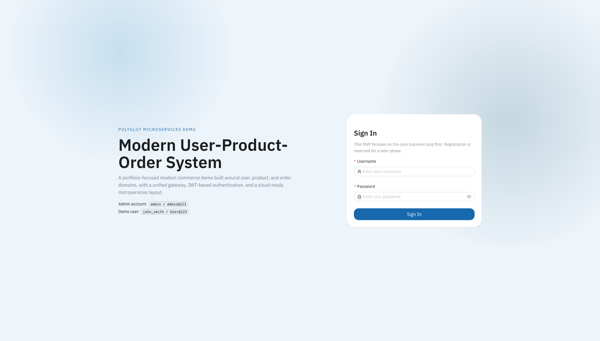
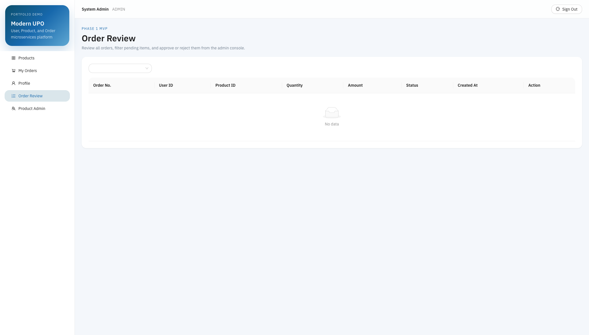
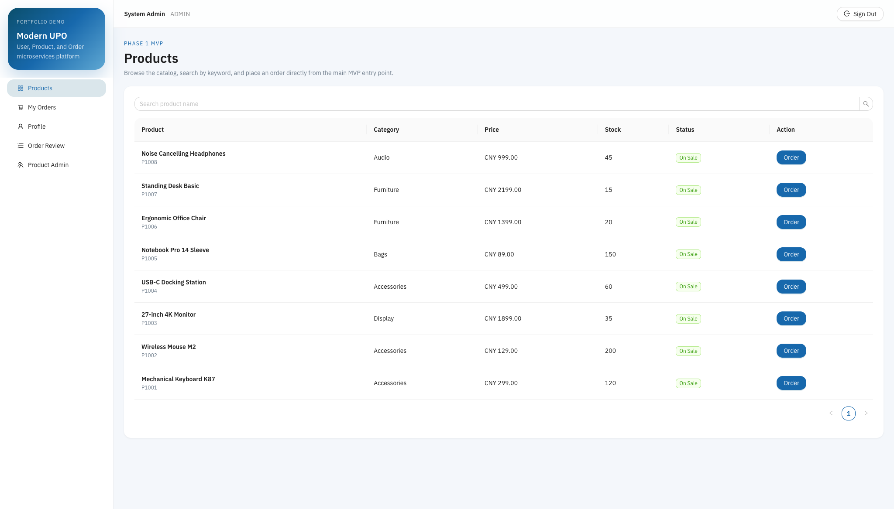
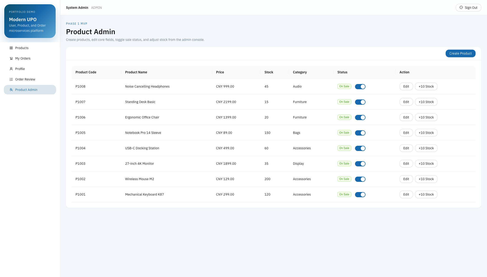

# Modern User-Product-Order System

A portfolio-focused polyglot microservices commerce demo built around three core domains:

- users
- products
- orders

The project is intentionally designed as a **minimal but complete modern architecture demo**. It emphasizes clear service boundaries, runnable local development, API-driven frontend integration, and room for production-oriented upgrades such as Redis, RabbitMQ, Kubernetes, and cloud deployment.

## Highlights

- Polyglot backend:
  - `user-service` in Python / FastAPI
  - `product-service` in Python / FastAPI
  - `order-service` in Java / Spring Boot
- Dedicated API gateway with JWT verification and route forwarding
- React + Vite + TypeScript frontend
- MySQL split by domain schema
- Idempotency-ready order design with `request_no`
- Admin and user flows in a single demo UI
- Local-first development with infrastructure already available for Redis and RabbitMQ

## Current Status

The repository is under phased implementation.

- Phase 1:
  - login
  - profile update
  - password change
  - product listing
  - create order
  - cancel order
  - admin order review
  - admin product management
- Phase 2:
  - Redis
  - RabbitMQ
  - Docker Compose
  - unified production polish
- Phase 3:
  - Kubernetes
  - monitoring
  - load testing
  - AWS migration notes

AWS deployment is **not live yet**, so no cloud access links are shown in this README.

## Screenshots

### Sign-In



### Admin Order Review



### Product Listing



### Product Admin



## Architecture Overview

### Services

- `frontend`
  - React application for user and admin flows
- `gateway`
  - FastAPI gateway for routing, JWT verification, and request user context propagation
- `services/user-service`
  - authentication and user profile management
- `services/product-service`
  - product listing, product administration, stock mutation APIs
- `services/order-service`
  - order creation, cancellation, and admin approval / rejection

### Data and Infra

- MySQL
  - `h_user_db`
  - `h_product_db`
  - `h_order_db`
- Redis
  - reserved for Phase 2 caching and token support data
- RabbitMQ
  - reserved for Phase 2 async order event handling
- MongoDB
  - intentionally reserved for a later audit / event timeline extension, not the critical transaction path

## Tech Stack

### Frontend

- React 18
- Vite
- TypeScript
- Ant Design
- Axios
- React Router

### Backend

- FastAPI
- SQLAlchemy
- Spring Boot
- Spring Data JPA
- Spring Security
- springdoc-openapi

### Infrastructure

- MySQL 8
- Redis 7
- RabbitMQ 3
- Docker / Docker Compose
- Kubernetes manifests planned in later phases

## Repository Structure

```text
modern-user-product-order-system/
├── frontend/
├── gateway/
├── services/
│   ├── user-service/
│   ├── product-service/
│   └── order-service/
├── docs/
├── infra/
├── scripts/
└── .github/workflows/
```

## Local Run

### 1. Start the backend services

Gateway:

```bash
cd gateway
python3 -m venv .venv
source .venv/bin/activate
pip install -r requirements.txt
uvicorn app.main:app --reload --port 8000
```

User service:

```bash
cd services/user-service
python3 -m venv .venv
source .venv/bin/activate
pip install -r requirements.txt
uvicorn app.main:app --reload --port 8001
```

Product service:

```bash
cd services/product-service
python3 -m venv .venv
source .venv/bin/activate
pip install -r requirements.txt
uvicorn app.main:app --reload --port 8002
```

Order service:

```bash
cd services/order-service
mvn spring-boot:run
```

### 2. Start the frontend

```bash
cd frontend
npm install
npm run dev
```

Frontend URL:

- `http://localhost:5173`

## Local Access Points

- Frontend: `http://localhost:5173`
- Gateway docs: `http://127.0.0.1:8000/docs`
- User service docs: `http://127.0.0.1:8001/docs`
- Product service docs: `http://127.0.0.1:8002/docs`
- Order service docs: `http://127.0.0.1:8080/swagger-ui/index.html`

## Demo Accounts

- Admin: `admin / Admin@123`
- Demo user: `john_smith / User@123`

## Important Local Notes

- The JWT secret used by the gateway and user-service must match.
- The MySQL application user must have access to:
  - `h_user_db`
  - `h_product_db`
  - `h_order_db`
- The frontend currently assumes the gateway is reachable at `http://localhost:8000`.
- The current UI is English-only for now. Internationalization can be added later.

## Documentation

- [Architecture](docs/architecture.md)
- [Database Design](docs/database-design.md)
- [API Overview](docs/api-overview.md)
- [Frontend README](frontend/README.md)
- [Gateway README](gateway/README.md)
- [User Service README](services/user-service/README.md)
- [Product Service README](services/product-service/README.md)
- [Order Service README](services/order-service/README.md)

## Near-Term Next Steps

- finish end-to-end order review flow verification
- add Docker Compose for one-command local startup
- integrate Redis caching
- integrate RabbitMQ domain events
- add Kubernetes manifests
- add monitoring and load-test artifacts
