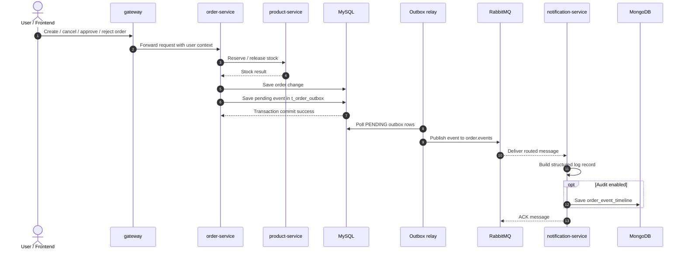
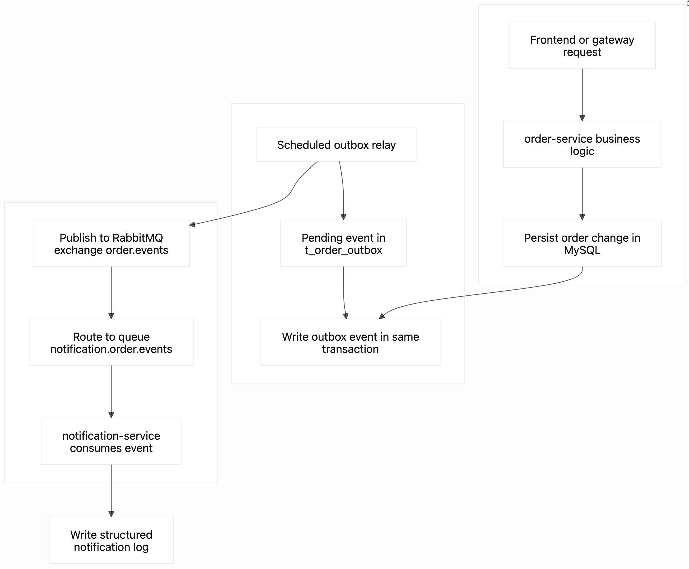
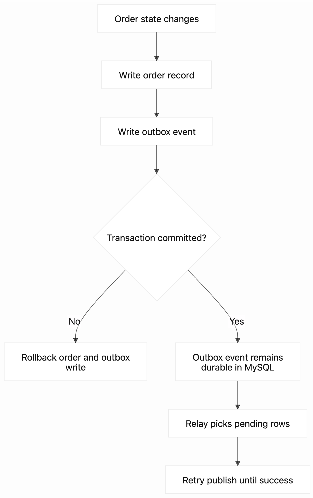
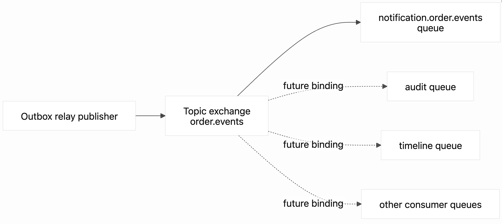
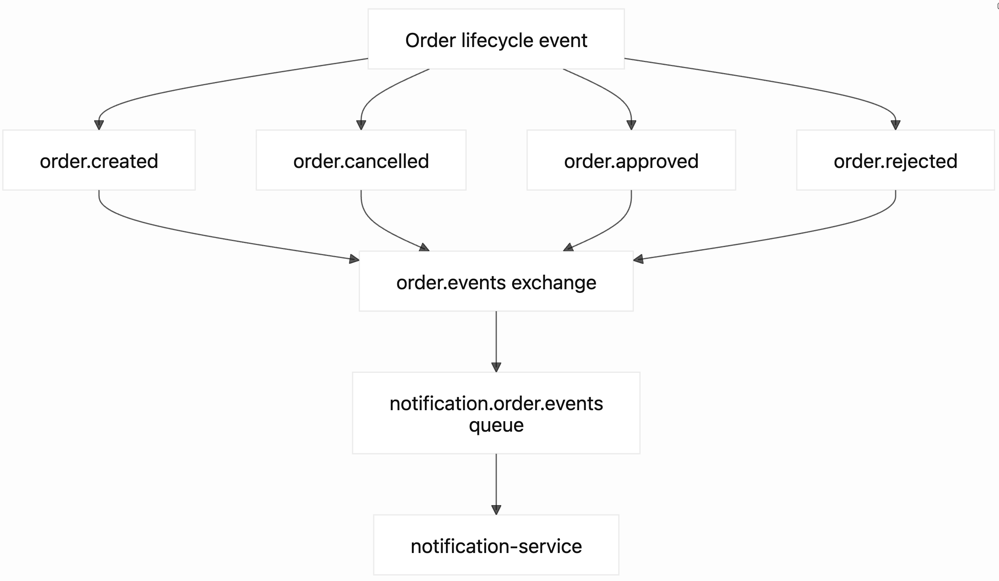

# Architecture

## Core Transaction Path

- `gateway` receives external traffic
- `user-service` authenticates users and manages user profile data
- `product-service` serves catalog queries and performs inventory reservation/release for internal order flows
- `order-service` owns order creation and state transitions

## Data Responsibilities

- MySQL:
  - source of truth for users, products, orders
- Redis:
  - active for product catalog query cache in `product-service`
  - active for token blacklist support shared by `user-service` and `gateway`
  - active for gateway login and order creation rate limiting
- RabbitMQ:
  - active for outbox-relayed order lifecycle event fan-out from `order-service`
  - consumed by `notification-service` for structured notification logging
- MongoDB:
  - active as an optional `order_event_timeline` sink in `notification-service`
  - still reserved for side-channel audit logs and notification records outside the critical write path

## MongoDB Reservation Strategy

MongoDB is intentionally reserved for side-channel operational data instead of core transaction records.

Planned usage:

- order event timeline documents
- notification delivery records
- gateway or admin audit logs

Not planned for the critical write path:

- user source-of-truth records
- product source-of-truth records
- order source-of-truth records
- inventory mutation authority

## Service Interaction

1. User logs in through `gateway`
2. `gateway` proxies login to `user-service`
3. `user-service` validates BCrypt password and issues JWT
4. Product queries are served by `product-service`
5. Order creation is handled by `order-service`
6. `order-service` calls internal `product-service` endpoints to reserve or release inventory
7. `order-service` writes lifecycle events into `t_order_outbox` inside the same transaction as order mutations
8. a scheduled relay publishes pending outbox records to RabbitMQ
9. `notification-service` consumes the events, records notification-style logs, and can persist them into MongoDB for audit lookup

## RabbitMQ Event Flow

This project keeps the order write path in MySQL and pushes side-channel event work into RabbitMQ. The message path is intentionally split into a reliable main chain and a few supporting side chains.

## Message Sequence



### Main Chain



Main chain summary:

- order mutations and outbox records are committed together
- the relay publishes pending outbox records to the `order.events` topic exchange
- `notification-service` consumes routed messages for logging and optional audit persistence

### Reliability Side Chain



This side chain explains why RabbitMQ publication is not part of the critical write transaction itself: the system first makes the event durable in MySQL, then lets the relay publish and retry outside the request path.

### Routing Side Chain



This side chain shows the fan-out role of RabbitMQ:

- the publisher sends once to `order.events`
- each downstream capability can bind its own queue without changing `order-service`
- current productionized consumer is `notification-service`; other queues are an intentional extension point

### Current Event Types



## Branch-to-Environment Mapping

- `dev` branch
  - feeds the `dev` runtime environment
  - optimized for ongoing implementation work
- `sandbox` branch
  - feeds the `sandbox` runtime environment
  - optimized for integrated verification and demo readiness
- `main` branch
  - represents the latest stable baseline
  - reserved as the future production promotion source

Recommended promotion chain:

```text
feature/* -> dev -> sandbox -> main
```

## Design Principles

- keep the first version runnable before making it sophisticated
- keep core transaction data in MySQL
- reserve document/event stores for side-channel data
- use shared response envelopes across services
- keep MongoDB out of the critical write path for Phase 1
