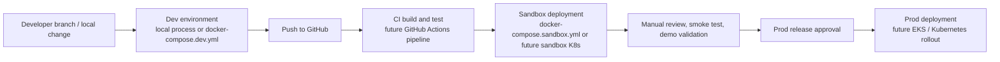

# Architecture

## Core Transaction Path

- `gateway` receives external traffic
- `user-service` authenticates users and manages user profile data
- `product-service` serves catalog queries and performs inventory reservation/release for internal order flows
- `order-service` owns order creation and state transitions

## Data Responsibilities

- MySQL:
  - source of truth for users, products, orders
- Redis:
  - active for product catalog query cache in `product-service`
  - reserved next for token support data and rate limiting
- RabbitMQ:
  - reserved for order event fan-out in Phase 2
- MongoDB:
  - reserved for audit logs, order event timeline, and notification records

## MongoDB Reservation Strategy

MongoDB is intentionally reserved for side-channel operational data instead of core transaction records.

Planned usage:

- order event timeline documents
- notification delivery records
- gateway or admin audit logs

Not planned for the critical write path:

- user source-of-truth records
- product source-of-truth records
- order source-of-truth records
- inventory mutation authority

## Service Interaction

1. User logs in through `gateway`
2. `gateway` proxies login to `user-service`
3. `user-service` validates BCrypt password and issues JWT
4. Product queries are served by `product-service`
5. Order creation is handled by `order-service`
6. `order-service` calls internal `product-service` endpoints to reserve or release inventory

## Future Release Flow



## Branch-to-Environment Mapping

- `dev` branch
  - feeds the `dev` runtime environment
  - optimized for ongoing implementation work
- `sandbox` branch
  - feeds the `sandbox` runtime environment
  - optimized for integrated verification and demo readiness
- `main` branch
  - represents the latest stable baseline
  - reserved as the future production promotion source

Recommended promotion chain:

```text
feature/* -> dev -> sandbox -> main
```

## Design Principles

- keep the first version runnable before making it sophisticated
- keep core transaction data in MySQL
- reserve document/event stores for side-channel data
- use shared response envelopes across services
- keep MongoDB out of the critical write path for Phase 1
