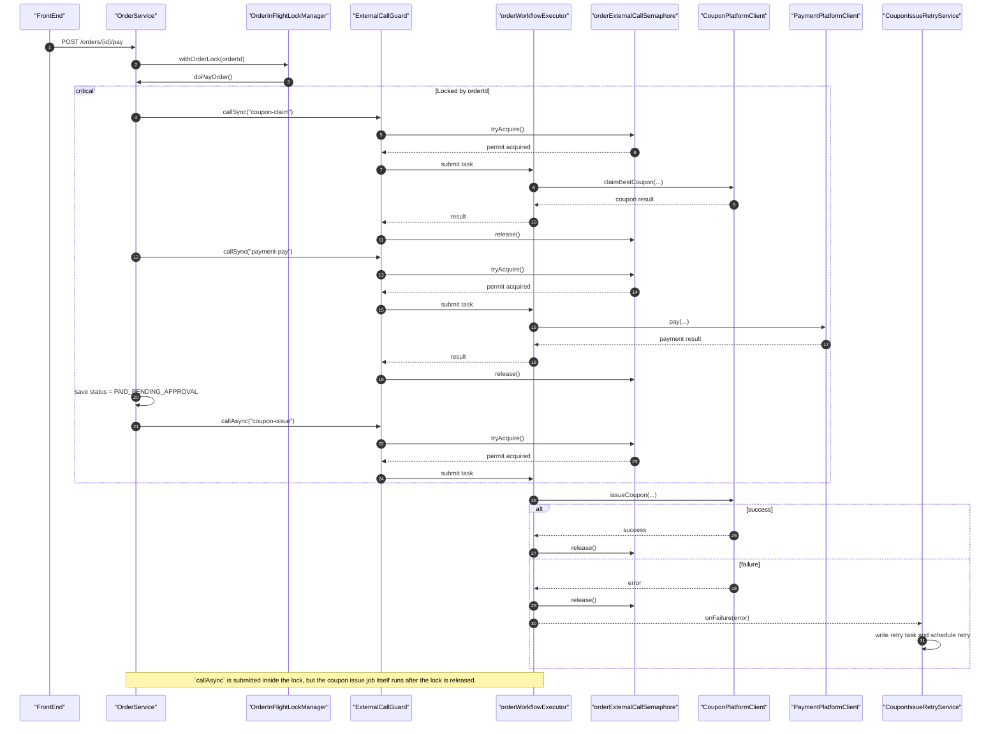
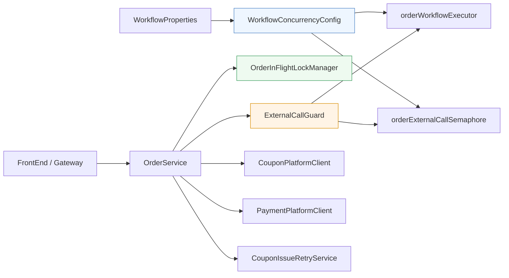

# order-service

Spring Boot service responsible for order creation and approval flow.

## Responsibility

- create single-product orders
- enforce request-level idempotency via `request_no`
- list current user's orders
- cancel pending orders
- list all orders for admin review
- approve or reject pending orders
- call product-service internal APIs to reserve and release stock
- write order lifecycle events into an outbox table and relay them to RabbitMQ asynchronously

## Database

- schema: `h_order_db`
- table: `t_order`
- future Phase 2 table: `t_message_consume_log`

Important columns currently used:

- `order_no`
- `request_no`
- `user_id`
- `product_id`
- `quantity`
- `total_amount`
- `status`
- `reject_reason`
- `approve_time`
- `cancel_time`
- `version`

Phase 3 workflow preparation columns:

- `origin_amount`
- `discount_amount`
- `final_amount`
- `payment_time`
- `ship_time`
- `expected_delivery_time`
- `complete_time`
- `refund_time`

Additional Phase 2 table:

- `t_order_outbox`
- `t_order_coupon_issue_task`

## Important Environment Requirement

The MySQL application user must have access to `h_order_db`.

Example grant:

```sql
GRANT ALL PRIVILEGES ON h_order_db.* TO 'app'@'%';
FLUSH PRIVILEGES;
```

Without that grant, the service cannot boot because JPA cannot initialize against the schema.

## Current Endpoints

- `POST /orders`
- `POST /orders/{id}/pay`
- `POST /orders/{id}/cancel`
- `GET /orders/my`
- `GET /admin/orders`
- `POST /admin/orders/{id}/approve`
- `POST /admin/orders/{id}/reject`
- `GET /health`
- `GET /ready`
- `GET /live`

Admin workflow semantics (Phase 3):

- `approve` transitions order to shipping state, with expected delivery time set to next day at the same clock time
- `reject` now triggers refund flow first; after refund success, order transitions to `REJECTED`

## Event Publishing

- exchange: `order.events`
- routing keys:
  - `order.created`
  - `order.cancelled`
  - `order.approved`
  - `order.rejected`
- delivery mode:
  - order mutations write to `t_order_outbox` inside the transaction
  - a scheduled relay publishes pending outbox records to RabbitMQ

## Directory Guide

- `src/main/java/com/example/orders/controller/`: external APIs
- `src/main/java/com/example/orders/service/`: business logic and product-service client
- `src/main/java/com/example/orders/entity/`: JPA entity
- `src/main/java/com/example/orders/repository/`: JPA repository
- `src/main/java/com/example/orders/security/`: request user extraction from gateway headers
- `src/main/resources/application.yml`: datasource and service config

## Local Run

```bash
mvn spring-boot:run
```

## API Docs

- Swagger UI: `http://localhost:8080/swagger-ui/index.html`

## Environment Variables

See:

- `services/order-service/.env.example`

Workflow integration toggles (Phase 3 preparation, disabled by default):

- `APP_COUPON_PLATFORM_ENABLED`
- `APP_COUPON_PLATFORM_BASE_URL`
- `APP_COUPON_PLATFORM_ISSUE_PATH_TEMPLATE`
- `APP_COUPON_PLATFORM_CLAIM_BEST_PATH_TEMPLATE`
- `APP_COUPON_PLATFORM_INTERNAL_TOKEN`
- `APP_COUPON_PLATFORM_CONNECT_TIMEOUT_MS`
- `APP_COUPON_PLATFORM_READ_TIMEOUT_MS`
- `APP_PAYMENT_PLATFORM_ENABLED`
- `APP_PAYMENT_PLATFORM_PAY_DELAY_MS`
- `APP_PAYMENT_PLATFORM_REFUND_DELAY_MS`
- `APP_PAYMENT_PLATFORM_CONNECT_TIMEOUT_MS`
- `APP_PAYMENT_PLATFORM_READ_TIMEOUT_MS`
- `APP_WORKFLOW_EXECUTOR_CORE_POOL_SIZE`
- `APP_WORKFLOW_EXECUTOR_MAX_POOL_SIZE`
- `APP_WORKFLOW_EXECUTOR_QUEUE_CAPACITY`
- `APP_WORKFLOW_EXTERNAL_SEMAPHORE_PERMITS`
- `APP_WORKFLOW_SEMAPHORE_ACQUIRE_TIMEOUT_MS`
- `APP_WORKFLOW_COUPON_ISSUE_RETRY_FIXED_DELAY_MS`
- `APP_WORKFLOW_COUPON_ISSUE_RETRY_DELAY_SECONDS`
- `APP_WORKFLOW_COUPON_ISSUE_MAX_RETRIES`

## Docker

- Dockerfile: `services/order-service/Dockerfile`
- Compose service name: `order-service`
- Local container docs: `http://localhost:8080/swagger-ui/index.html`
- In the `dev` runtime, RabbitMQ validation should point to your host-managed local broker, such as `rmq` on `localhost:5672`.

## Dependencies

- MySQL `h_order_db`
- product-service internal APIs on `http://localhost:8002`
- RabbitMQ for order domain events
- local table `t_order_outbox` for transactional event staging

## Maintenance Notes

- JSON output uses `snake_case` to align with the current frontend contract.
- The service trusts gateway-provided request headers for user context in Phase 1.
- Create-order now follows a two-step checkout model:
  - create order first (`PAYING`)
  - then user triggers pay endpoint to complete payment and move to `PAID_PENDING_APPROVAL`
- Coupon claim and payment simulation run during the pay step, not the create step.
- If order persistence fails after stock reservation, the service currently attempts stock release as compensation.
- RabbitMQ delivery now goes through `t_order_outbox`, so order transactions and event staging happen together before relay publishing.

## Concurrency Flow

The pay path uses a dedicated workflow thread pool, a semaphore guard for external calls, and a per-order lock for the same `order_id`.
This keeps concurrent retries safe while still allowing different orders to proceed in parallel.



## Component Map

This map shows how the concurrency-related pieces in `order-service` relate to each other.
`WorkflowConcurrencyConfig` creates the shared executor and semaphore, `OrderInFlightLockManager` protects the same order id, and `ExternalCallGuard` wraps all external calls through the shared concurrency tools.



## Near-Term TODO

- add stronger optimistic concurrency control on state transitions
- add dead-letter handling and richer delivery tracing for RabbitMQ
- add order query filters beyond status
